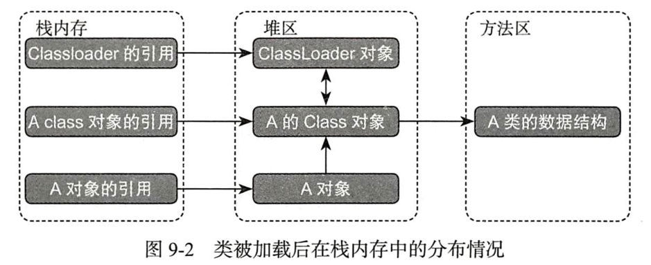

#####类加载器
任意class都由加载它的类加载器和这个类本身确立其JVM中的唯一性。
任何对象的class实例在同一个类加载器命名空间下唯一,在堆内存以及方法区中肯定唯一。
每一个类加载器实例都有各自的命名空间，由该加载器及其所有父加载器构成。
BootStrap ClassLoader -- Ext ClassLoader -- Application ClassLoader
                                                                    --Custom ClassLoaderXX
                                                                    
BootStrap ClassLoader顶层，无父加载器，由C++编写，负责虚拟机核心类库加载，如java.lang包。可通过-Xbootclasspath指定路径。
Ext ClassLoader，由java实现，sun.misc.Launcher$ExtClassLoader
系统类加载器，负责classpath下的资源，是自定义类加载器的默认父加载器。

包名和类名构成了类的全限定名。
JVM运行时class会有一个运行时包，是由类加载器的命名空间和类的全限定名称共同组成。

初始类加载器：在类的加载过程中，所有参与的类加载器，即使没有亲自加载过该类，也都会被标识为该类的初始类加载器。
每个加载器内部维护一个查找过的已存在的类列表，只有在列表中且运行时包相同才能访问包访问权限的方法。

-verbose:class查看运行时加载了多少class

某对象在堆内存中如果没有其他地方引用则会在垃圾回收器线程进行GC时回收。

对象在堆内存的Class对象以及Class在方法区中的数据结构回收时机：
该类所有实例都已被GC、加载该类的ClassLoader实例被回收
该类的Class实例没有被引用

双亲委托机制是一种包含关系，而非继承关系

ContextClassLoader：
当前线程上下文的类加载器，
早期java提供的SPI机制，如JDBC/JNDI/JAXP，接口都在jdk的rt核心包中，JDK只规定了这些接口之间的逻辑关系，而厂商提供具体实现。
使用JDBC这个SPI完全透明了应用程序和第三方数据库驱动的具体实现。JDBC提供了高度抽象，应用程序面向接口编程

如JDBC，mysql-connector-java中，com.mysql.jdbc.Driver的静态代码块中调用jdk的类进行注册DriverManager.registerDriver，
这个是没问题的，因为当前Driver肯定是被app加载器加载的，而用到DriverManager时，app又是初始加载器。
但是当getConnection时，jdk会调用Class.forName加载刚才注册过的类，但是DriverManager是在java.sql包下，是由boot加载器加载的，
在这里是不会找到子加载器的com.mysql.jdbc.Driver的！所以getConnection代码用到caller.getClassLoader()或者
Thread.currentThread().getContextClassLoader()即调用getConnection线程所在上下文加载器，一般是app加载器，这样其实就破坏
了双亲委托机制。
现在使用的slf4j接口和实现都是由app加载的，不会出现上面问题

#####类加载过程
-XX:+TraceClassLoading

1. 装载(通过类全名产生二进制流，解析二进制流,将静态的存储结构转换成方法区中运行时的数据结构，在堆中构造一个该类型的java.lang.Class对象，作为
方法区数据结构被访问的入口)

对同一个ClassLoader，不管类被加载多少次，对应到堆内存中的class对象都是一个，全限定名(包名+类名)。
2. 连接(

a. 验证：VerifyError
+ 验证文件格式：class文件的魔术因子：OxCAFEBABE、主次版本号、class文件中的MD5指纹、常量池中是否有不被支持的变量类型、指向常量中的引用是否指到了
不存在的常量或该常量的类型不被支持。
+ 元数据的验证：语义分析
类是否存在父类，是否继承接口，父类和接口是否合法，或者存在
类是否继承了被final修饰的类
检查类是否抽象类，是否实现抽象方法或接口方法
检查方法重载的合法性
+ 字节码验证：验证程序的控制流程，如循环、分支等
保证当前线程在程序计数器中的指令不会跳转到不合法的字节码指令。
保证类型转换合法
保证任意时刻，虚拟栈中操作栈类型与指令代码都正确执行，如压栈时A类型引用，使用时却将B类型载入了本地变量表
+ 符号引用验证：验证符号引用转换为直接引用时合法性，保证解析动作顺利。NoSuchFieldError/NoSuchMethodError
通过符号引用描述的字符串全限定名是否能找到相关类
符号引用中的类、字段、方法是否对当前类可见

b. 准备-分配内存并初始默认值(对于static final field)
为类的静态变量分配内存并设初始值，被分配到方法区中。
对于简单的static final变量可直接计算结果的，不会导致类的初始化，被动引用，就不需要下面连接阶段了。是直接在编译阶段javac会将值生成
在ConstantValue属性。

c. 解析-符号引用改成直接引用(可选)，在常量池中寻找类、接口字段和方法的符号引用(助记符-编译阶段生成)，并将这些符号引用替换成直接引用。
getstatic获取引用然后调用invokexx执行，在getstatic之前需要解析。

虚拟机规范规定：在anewarray、checkcast、getfield、getstatic、instanceof、invokeinterface、invokespecial、invokestatic、
invokevirtual、multianewarray、new、putfield、putstatic这13个操作符引用的字节码指令之前，必须对所有的符号提前进行解析。

解析过程是对针对常量池为：CONSTANT_Class_info(接口)、CONSTANT_Fieldref_info(字段)、Constant_Methodref_info(类方法)、
Constant_InterfaceMethodref_info(接口方法)

+ 类接口解析
类需要经历加载阶段，然后解析验证符号引用
如果仅仅是某类型的数组，则JVM不需要对类加载，只需要生成一个能够代表该类型的数组对象，并在堆内存中开辟一片连续地址空间。
+ 字段的解析，解析类的或者接口的字段
若类中本本身包含某个字段，则直接返回这个字段的引用，需要对该字段属性的类提前加载
若类不存在该字段，则向上查找父类或接口，直到找到
若以上失败，则不再进行解析，抛出NoSuchFieldError异常
+ 类方法的解析
若在本类方法表中发现class_index中索引的目标类是一个接口不是类则返回错误
在目标类中查找是否有方法描述和本类中掉用方法完全一致的方法，若有则返回这个方法的引用，否则继续向上查找
若以上没有则抛出NoSuchMethodError
若方法一致，但是目标类是一个抽象类，则抛出AbstractMethodError
+ 接口方法的解析
在当前接口方法表中发现class_index中索引的目标是一个类而不是接口，直接返回错误
上下而上查找目方法，存在则返回引用，否则抛出NoSuchMethodError异常

)

3. 初始化(需要主动使用)-变量设置初始真正值。
执行<clinit>() class initialize。编译期生成。包含所有类变量赋值动作和静态语句块，按照字段顺序生成。
虚拟机保证父类<clinit>()先执行。

延迟加载
同一个运行时包下，只初始化一次Class

4. 首次*主动使用*时才初始化
   1. new
   2. 访问类的静态变量(除简单final字段)
   3. 访问类的静态方法
   4. 对类进行反射操作，如Class.forName(且initial=true)
   5. 初始化子类会导致父类初始化(注：通过子类使用父类的静态变量只会导致父类初始化)
   6. 启动类会被初始化(main所在类)

5. 初始化顺序：(clinit包含了顺序的静态字段和代码块，构造函数是字段的赋值和原构造函数方法)
先加载当前类，若有父类则加载父类

静态父类(变量、代码块)-静态子类(变量、代码块)

当构造对象时
上述初始化后--实例父类(变量-已经被编译到构造器中了、代码块、构造函数，若是这时用到子类属性则是默认值)-实例子类(变量、代码块、构造函数)