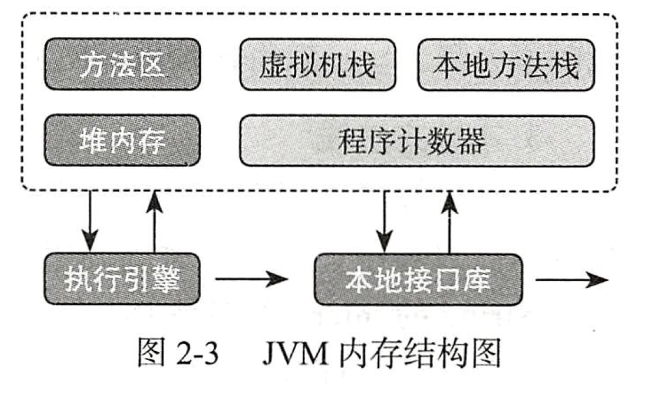
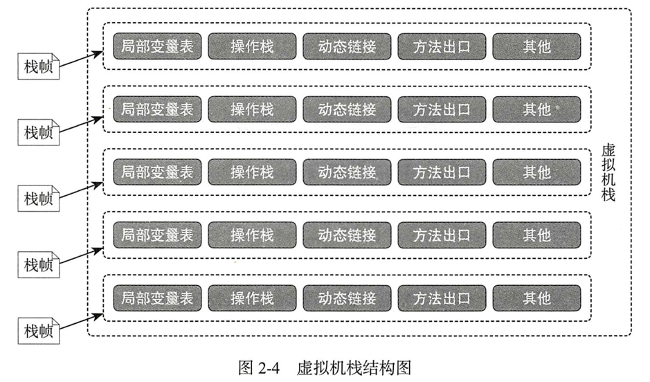
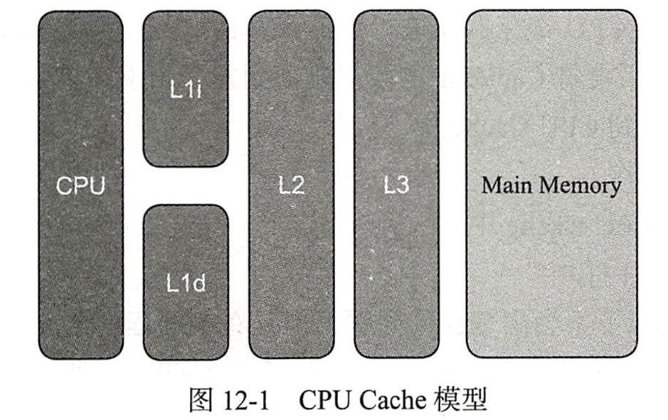
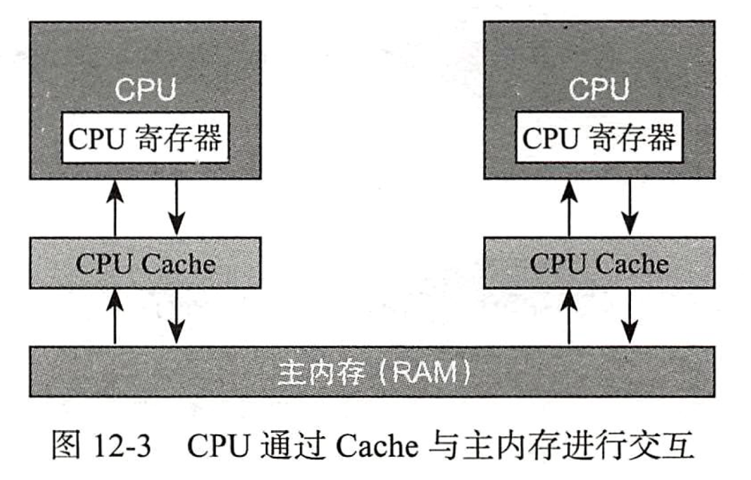
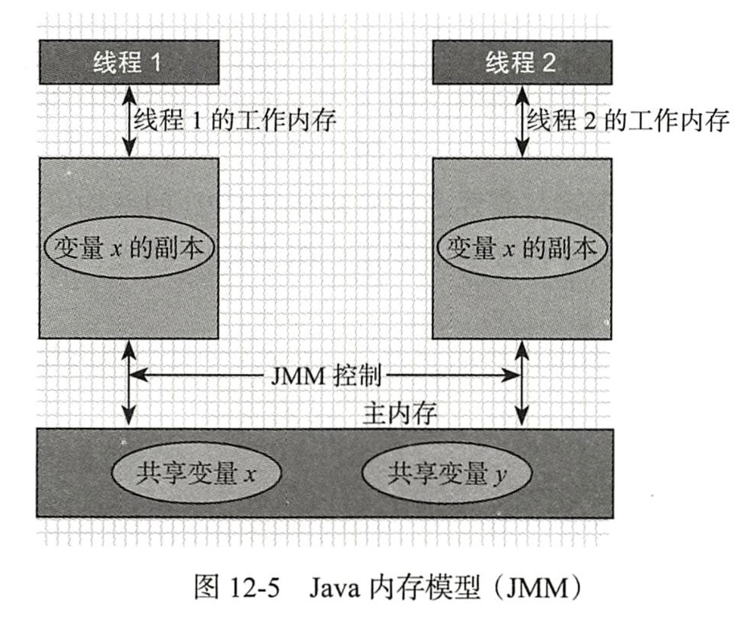
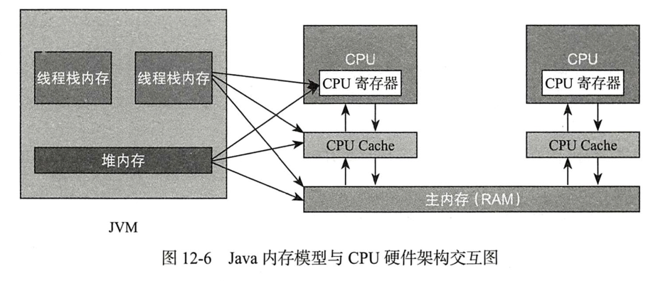

#####jvm内存结构
jvm在执行java程序时把物理内存划分成不同的内存区域，每个区域放着不同数据，也有不同创建和销毁实时机，
有些分区会在启动时创建，有些则运行时创建，入虚拟机栈。如下图：

程序计数器
任何语言，都是最终由操作系统通过控制总线向CPU发送机器指令。程序计数器在JVM中作用就是用于存放当前线程
接下来要执行的字节码指令、分支、循环、跳转、异常处理等信息。任何时候一个处理器只能只能执行其中一个线程
中的指令，为了能在CPU的时间片轮转切换上下文之后顺利回到正确的执行位置，每条线程都需要具有一个独立的程序
计数器，各自不影响，此内存区域线程私有。像是kafka那样把每个消息的下标放在各自client端而不是集中化处理。
无任何溢出异常。

java虚拟机栈(与线程创建、运行、销毁等关联最大。-Xss。查看默认:java -XX:+PrintFlagsFinal -version|grep ThreadStackSize)
线程私有，生命周期与线程相同，每个线程在创建时，JVM会为其创建对应的虚拟机栈，当方法在
执行的时候会创建一个栈帧(stack frame)数据结构，用于存放局部变量表、操作栈、动态链接、方法出口等信息。
方法的调用对应栈帧在虚拟机栈中的压栈和弹栈的过程。大小通过-xss配置，栈帧的数量称为虚拟机栈的深度。

虚拟机栈越大则能创建的线程总数越小。
粗略认为：进程的内存=堆内存+线程数量*栈内存，那么堆内存越大则可以创建的线程数量越小。
精准：线程数量=(最大内存地址空间(MaxProcessMemory)-JVM对内存-ReservedOsMemory)/ThreadStackSize(Xss)
线程数量还和操作系统的一些内核配置关系，如linux,
/proc/sys/kernel/threads-max
/proc/sys/kernel/pid_max
/proc/sys/vm/max_map_count

本地方法栈
线程私有内存域，java中调用本地方法接口(java native interface),也就是c/c++程序，如网络通信、文件
操作的底层等，JVM为本地方法调用时划分的内存区域。

堆内存(-Xmx -Xms)
线程共享，运行期间创建的大部分对象。又称GC堆。分为新生代(Eden、from survivor、to survivor)和老年代

方法区
线程共享，存储已经被虚拟机加载的类信息、常量、静态变量、即时编译器(JIT)编译后的代码等数据。又称非堆或持久代。

java8元空间(Meta Space)(jstat -gcutil 11514 1000 10中看到M列)
持久代内存被元空间替代。元空间同样是堆内存的一部分，JVM为每个类加载器分配一块内存块列表，进行线性分配，大小
取决于类加载的类型，sun/反射/代理对应的类加载器块会小一些， 之前的版本会单独卸载回收某个类，而现在GC过程中
菲娜某个类加载器已经具备回收的条件，则将整个类加载器相关的元空间全部回收，减少内存碎片，节省GC扫描和压缩时间

#####cpu的cache与主存不一致
计算机中，所有运算操作都有CPU的寄存器来完成，CPU指令的执行过程需要涉及数据的读取和写入，CPU所能访问的数据只能是计算机的主存(RAM)。
CPU处理速度和内存的访问速度差距很大，通过FSB直接连接内存访问方式很大限制了CPU的吞吐量，于是就有了CPU和主内存之前增加缓存的设计，
最靠近CPU的缓存为L1，依次是L2,L3和主内存。
由于程序指令和程序数据的行为和热点分布差异很大，因此L1 Cache又被划分L1i(instruction)和L1d(data)。CPU Cache又是由很多
Cache Line构成，Cache Line是CPU Cache中最小的缓存单位，主流的CPU Cache的Cache Line大小是64字节

程序运行过程中，将运算所需数据从主存复制一份到CPU Cache中，运算后，刷新到主内存。提高吞吐。

每个线程都有自己的工作内存(本定内存，对应CPU的Cache)。

CPU缓存一致性问题：如，i++问题
1. 通过总线加锁：早期CPU，悲观，CPU和其他组件通信都是通过总线(数据总线、控制总线、地址总线)来进行，若采用总线加锁，则会阻塞其他CPU对其他
组件的访问，从而只能有一个CPU(抢到总线锁)能访问这个变量的内存。效率低下。

2. 通过缓存一致性协议
Intel的MESI协议，保证每一个缓存中使用共享变量副本都是一致的。
大致思想：当CPU在操作Cache中的数据时，如果发现该变量是一个共享变量(其他cpu cache也有副本)，那么进行如下操作：
a.读取操作，不做任何处理，只是将cache中的数据读到寄存器。
b.写入操作，发出信号通知其他cpu将该变量的cache line置为无效，其他cpu在进行该变量读时必须从主内存中再次获取。

####java内存模型(java memory model,JMM)
指定了java虚拟机如何与计算机的注册(RAM)进行工作

java的内存模型决定了一个线程对共享变量的写入何时对其他线程可见。定义了线程和主内存之间的抽象关系：
共享变量存储于主内存中，每个线程都可以访问
每个线程都有私有的工作内存或称为本地内存
工作内存只存储该线程对共享变量的副本
线程不能直接操作主内存，只有先操作了工作内存之后才能写入主内存
工作内存和java内存模型一样也是抽象概念，其实并不存在，它涵盖了缓存、寄存器、编译器优化以及硬件等。

例如：主内存i=0,线程1和2拥有共享变量i的副本，线程1将工作内存修改为1，刷新到主内存，线程2想要使用副本i时，发现该变量失效，必须到
主内存中再次获取然后存入自己的工作内存中，和CPU与CPU Cache之间的关系相似。

java内存模型是个抽象概念，与计算机硬件结构并不完全一样，如计算机物理内存不会存在栈内存和堆内存的划分，堆内存或虚拟机栈内存都会对应
到物理的主内存，也有一部分堆栈内存数据可能存入CPU Cache寄存器中。

